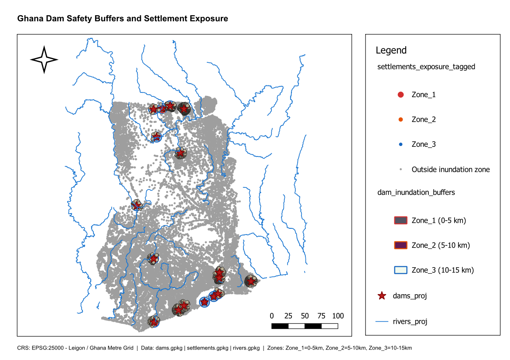

# Dam Safety Buffer and Settlement Exposure Map

**Country:** Ghana
**CRS:** EPSG:25000 - Leigon / Ghana Metre Grid
**Project file:** `Dam_Safety_Buffer_Settlement_Exposure.qgz`

---

## Overview

This project maps the exposure of settlements to potential dam inundation risk across Ghana. Inundation buffer zones are generated around each dam to approximate a downstream flood hazard area. Settlements within these zones are identified and tagged as exposed, providing a rapid screening tool for dam safety planning and disaster risk reduction.

## Reference Layout

---

## Objectives

- Generate inundation buffer zones around all dam locations.
- Identify settlements that fall within any dam inundation buffer.
- Tag all settlements with their exposure status for reporting and planning use.

## Methodology

1. Dam point features reprojected to EPSG:25000 and stored as `dams.gpkg`.
2. Inundation buffer zones generated around each dam to represent the potential flood hazard footprint: `dam_inundation_buffers.gpkg`.
3. Settlement points spatially intersected with inundation buffers; exposed settlements extracted to `settlements_within_inundation.gpkg`.
4. All settlements tagged with an exposure indicator: `settlements_exposure_tagged.gpkg`.
5. River network retained as contextual reference: `rivers.gpkg`.

## Output Layers

| File | Description |
|------|-------------|
| `dams.gpkg` | Dam locations reprojected to EPSG:25000 |
| `dam_inundation_buffers.gpkg` | Buffer zones representing dam inundation hazard footprints |
| `settlements.gpkg` | All settlements (input layer) |
| `settlements_within_inundation.gpkg` | Settlements within any dam inundation buffer |
| `settlements_exposure_tagged.gpkg` | All settlements tagged with inundation exposure status |
| `rivers.gpkg` | River network for hydrological context |

## Key Findings

- Several settlements in the Volta and Bono regions fall within dam inundation buffer zones, reflecting proximity to major reservoir infrastructure.
- Smaller community dams in upper-basin areas also produce exposure zones affecting nearby villages.
- The exposure layers provide a direct input for resettlement risk screening and infrastructure vulnerability assessments.

## Deliverables

| File | Type |
|------|------|
| `Dam_Safety_Buffer_Settlement_Exposure.qgz` | QGIS project |
| `Dam_Safety_Buffer_Settlement_Exposure.pdf` | Exported map layout |
| `reference_layout.png` | Print layout reference image |

## Notes

- All layers use EPSG:25000 (Leigon / Ghana Metre Grid).
- Buffer distances represent simplified inundation extents; detailed hydrological modelling is required for engineering-grade hazard delineation.

---

## Map Preview

